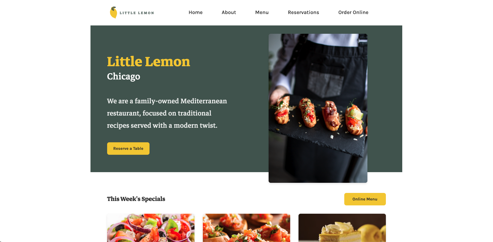
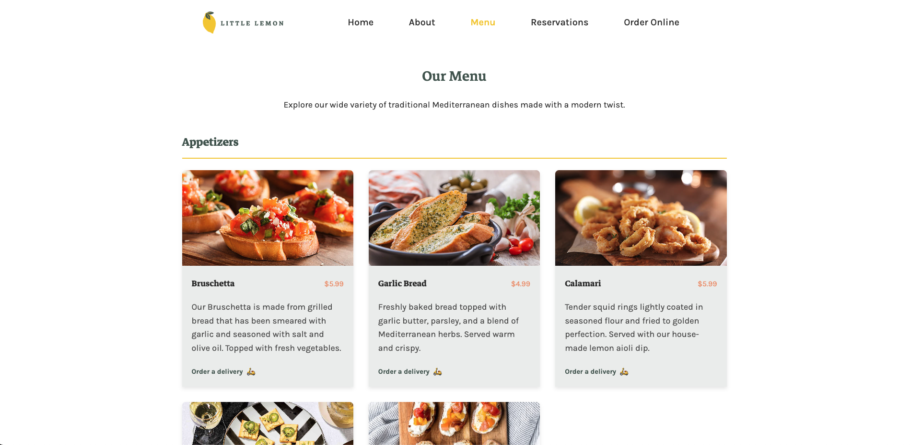
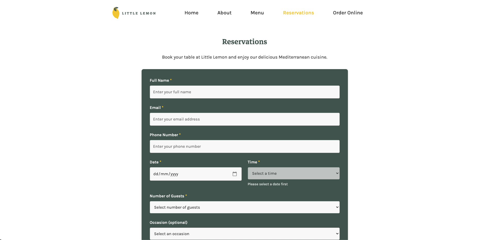

# Little Lemon Capstone Project


## 📌 Project Overview

**Project Name:** "Little Lemon Restaurant App"

## 🌟 Preview





## 🚀 Live Demo

[View Live Demo](https://littlelemon-capstone-app.vercel.app/) - Experience the app in action!

## 🏗️ Project Role

This project was developed as a solo effort. Design assets were provided as part of the project requirements.

## ✨ Description

This project was built using **React.js** to showcase my skills as a **Junior Front-End Developer**. It highlights best practices in UI/UX design, component-based architecture, scalability, and maintainability.

## 🌟 Key Features

- **Intuitive UI/UX**: Clean navigation and user-friendly interface with clear visual hierarchy
- **Responsive Design**: Custom breakpoints for optimal viewing on mobile, tablet, and desktop devices
- **Advanced Reservation System**: Full-featured booking functionality with time slot selection, party size options, and special requests
- **Real-time Form Validation**: Interactive feedback during reservation process with accessibility features
- **SCSS Architecture**: Consistent branded styling using SCSS architecture with variables, mixins, and partials for maintainable styling across a growing component library
- **Dynamic Menu Showcase**: Featured dishes with filtering options, descriptions, and vivid imagery
- **Customer Testimonials**: Review section with star ratings
- **Performance Optimization**: Built with Vite for near-instant HMR and optimized production bundles with automatic code splitting
- **Modular Component Design**: Reusable UI elements with consistent props interfaces for Cards, Buttons, and Form elements
- **Accessibility Compliant**: WCAG standards implementation for inclusive user experience

## 📑 Table of Contents

1. [Installation Guide](#-installation-guide)
2. [Project Architecture](#-project-architecture)
3. [Styling Architecture](#-styling-architecture)
4. [Testing & Performance](#-testing--performance)
5. [Challenges & Solutions](#-challenges--solutions)
6. [Deployment](#-deployment)
7. [License](#-license)
8. [Contact Information](#-contact-information)

---

## 🔧 Installation Guide

### Prerequisites

- **Node.js** (v18.0.0 or higher)
- **Git** (for cloning the repository)
- **React.js** (v18.3.0 or higher)

### Setup Instructions

1. Clone the repository:
   ```sh
   git clone https://github.com/Francisco1904/little-lemon-app-full.git
   cd little-lemon-app-full
   ```
2. Install dependencies:
   ```sh
   npm install
   ```
3. Compile SCSS to CSS:
   ```sh
   npm run scss:build
   ```
4. Start the development server:
   ```sh
   npm run dev
   ```
5. Open your browser and navigate to `http://localhost:5173/` to view the application.

---

## 🏗️ Project Architecture

### Tech Stack

- **Frontend:**
  - React.js (v18.3.1)
  - React Router for page navigation
  - SCSS for enhanced styling capabilities
  - CSS Custom Properties for theming
- **Build Tool:** Vite (v6.2.0)
- **Version Control:** Git & GitHub
- **Testing:** Vitest with React Testing Library
- **Deployment Platform:** Vercel

### 🔒 Security

This project follows security best practices for a React application. For details on how we handle dependency vulnerabilities and our security policy, please see [SECURITY.md](./SECURITY.md).

---

### Architecture Overview

The project follows a **component-based architecture** with clear separation of concerns:

- **Pages:** Container components that represent full pages in the application
- **Components:** Reusable UI elements that compose the pages
- **Assets:** Static resources like images and logos
- **Styles:** Global and component-specific styling using SCSS
- **Context:** State management for booking functionality

### Key Design Patterns

1. **Component Composition:** Building complex UIs from smaller, focused components
2. **Prop Drilling:** Passing data to child components through props
3. **SCSS Variables & Mixins:** Using SCSS features for consistent styling
4. **Responsive Design:** Mobile-first approach with flexible grid layouts
5. **BEM-style Naming:** For component organization in SCSS

### Folder Structure

```
├── src
│   ├── Components        # Reusable UI components (Header, Footer, Card, etc.)
│   ├── pages             # Page components (HomePage, ReservationsPage, etc.)
│   ├── assets            # Images and static resources
│   ├── context           # Context providers for state management
│   ├── utils             # Utility functions
│   ├── styles            # Styling files
│   │   ├── scss/         # Source SCSS files
│   │   │   ├── _variables.scss  # Design tokens and variables
│   │   │   ├── _mixins.scss     # Reusable patterns and functions
│   │   │   ├── _reset.scss      # CSS reset
│   │   │   ├── components/      # Component-specific styles
│   │   │   ├── pages/           # Page-specific styles
│   │   │   └── main.scss        # Main SCSS file that imports all partials
│   │   └── css/          # Compiled CSS (generated from SCSS)
│   ├── App.jsx           # Main application component
│   └── main.jsx          # Application entry point
```

---

## 🎨 Styling Architecture

### Modern SCSS Architecture

This project follows modern front-end development best practices by implementing a clean, organized SCSS architecture:

- **Single Source of Truth**: All styles are managed through SCSS and compiled into a single CSS file
- **Component-Based Organization**: Styles are organized by component and feature
- **Consistent Variables**: Design tokens are centralized in \_variables.scss for easy theming
- **Responsive Design**: Mobile-first approach with consistent breakpoint mixins
- **Performance**: CSS is optimized during build process
- **Future-Proof SASS Features**: Uses modern SASS modules and best practices to avoid deprecation warnings

### SCSS Structure

```
styles/
├── scss/                  # Source SCSS files
│   ├── _variables.scss    # Design tokens and variables
│   ├── _mixins.scss       # Reusable patterns and functions
│   ├── _reset.scss        # CSS reset/normalize
│   ├── _global.scss       # Global styles
│   ├── _typography.scss   # Text styling
│   ├── _buttons.scss      # Button components
│   ├── components/        # Component-specific styles
│   │   ├── _header.scss
│   │   ├── _footer.scss
│   │   └── ...etc
│   ├── pages/             # Page-specific styles
│   │   ├── _reservations.scss
│   │   └── ...etc
│   └── main.scss          # Main entry point that imports all partials
├── css/                   # Compiled CSS (don't edit directly)
    └── main.css           # The compiled stylesheet
```

### SCSS Features Used

- **Variables**: Defined in `_variables.scss` for consistent tokens
- **Nesting**: For cleaner, more readable selectors
- **Mixins**: For reusable style patterns
- **Partials**: Split styles into maintainable chunks
- **BEM-style naming**: For component organization
- **Modern Color Manipulation**: Utilizes the `sass:color` module for color adjustments instead of deprecated global functions
- **Clean Declaration Structure**: Follows SASS best practices for declaration ordering to prevent "mixed declarations" warnings

### Development Workflow

Run `npm run scss` to watch SCSS files and compile changes automatically during development.
Run `npm run scss:build` to compile a production-ready version for deployment.

---

## 🎨 CSS Architecture

This project follows modern front-end development best practices by implementing a clean, organized SCSS architecture:

### Structure

- **Single Source of Truth**: All styles are managed through SCSS files in `src/styles/scss/` and compiled into a single CSS file (`src/styles/css/main.css`)
- **Component-Based Organization**: Styles are organized by component and feature
- **Consistent Variables**: Design tokens are centralized in `_variables.scss` for easy theming
- **Responsive Design**: Mobile-first approach with consistent breakpoint mixins
- **Performance**: CSS is optimized during build process

### Key Files

- `src/styles/scss/` - Source SCSS files
  - `_variables.scss` - Design tokens and theme variables
  - `_mixins.scss` - Reusable style patterns
  - `_global.scss` - Global styles and utilities
  - `components/` - Component-specific styles
  - `pages/` - Page-specific layouts and styles

### Benefits

- **Maintainability**: Easier to maintain and update styles
- **Consistency**: Enforces design system consistency across components
- **Developer Experience**: Better organization for multiple developers
- **Performance**: Single CSS file reduces HTTP requests

---

## 🧪 Testing & Performance

### Testing Framework

- **Vitest:** For unit and component testing
- **React Testing Library:** For component-focused testing
- **User Event:** For simulating user interactions

### Performance Testing

The project includes several performance test suites to ensure optimal user experience:

- **Component Render Performance:** Measures render time for key components
- **Page Load Performance:** Measures CLS, FID, and LCP metrics using web-vitals
- **React Profiler Tests:** Uses React Profiler for detailed rendering analysis
- **Memory Usage Tests:** Ensures components don't introduce memory leaks
- **Navigation Performance:** Measures routing transition times

### Running Tests

```sh
# Run all tests
npm run test

# Run performance tests only
npm run test:performance

# Run specific test file
npm run test src/tests/performance/ComponentRenderTests.test.jsx
```

---

## 🔥 Challenges & Solutions

### Roadblocks Faced & Fixes:

1. **Issue: Navigation bar width mismatch with content**
   - ✅ **Solution:** Applied CSS flexbox adjustments and ensured consistent max-width across components.
2. **Issue: Component state not updating correctly**
   - ✅ **Solution:** Used controlled components and React's `useState` hook to manage state effectively.
3. **Issue: CSS maintainability with growing codebase**
   - ✅ **Solution:** Migrated to SCSS with partials, mixins, and variables for better organization.
4. **Issue: Form validation complexities**
   - ✅ **Solution:** Created custom validation system with error handling and accessibility features.
5. **Issue: Git conflicts during collaborative work**
   - ✅ **Solution:** Implemented proper Git branching strategies and resolved merge conflicts.
6. **Issue: Router context missing in component tests**
   - ✅ **Solution:** Implemented proper BrowserRouter wrapping for components using navigation hooks during testing.
7. **Issue: Performance bottlenecks in component rendering**
   - ✅ **Solution:** Created custom performance measurement utilities and established render time thresholds for key components.
8. **Issue: Accessibility for form validation errors**
   - ✅ **Solution:** Implemented ARIA attributes and screen reader announcements for improved error messaging.
9. **Issue: Mobile responsiveness breaking at specific breakpoints**
   - ✅ **Solution:** Refactored to a mobile-first approach with strategic breakpoints and fluid typography.
10. **Issue: State management complexity in booking flow**
    - ✅ **Solution:** Implemented React Context API with custom hooks for centralized booking state management.
11. **Issue: Memory leaks in components with timers/subscriptions**
    - ✅ **Solution:** Added proper cleanup with useEffect return functions and designed comprehensive memory usage tests.
12. **Issue: SASS deprecation warnings during build process**
    - ✅ **Solution:** Refactored to use `sass:color` module instead of global color functions and fixed mixed declaration patterns in SCSS files.

---

## 🌎 Deployment

### Steps to Deploy on Vercel (or Netlify, if used)

1. Build the project:
   ```sh
   npm run scss:build && npm run build
   ```
2. Deploy using Vercel CLI:
   ```sh
   vercel deploy
   ```
3. Obtain the deployment URL and verify the live project.

---

## 📝 License

This project is licensed under the [MIT License](./LICENSE). Feel free to use, modify, and distribute this project as per the terms of the license.

---

## 📬 Contact Information

- **GitHub:** [Francisco1904](https://github.com/Francisco1904)
- **Email:** [franciscopontes94@gmail.com](mailto:franciscopontes94@gmail.com)

---
